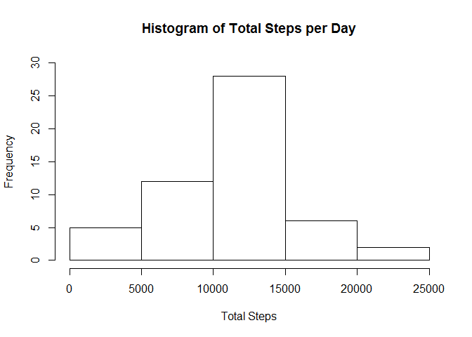
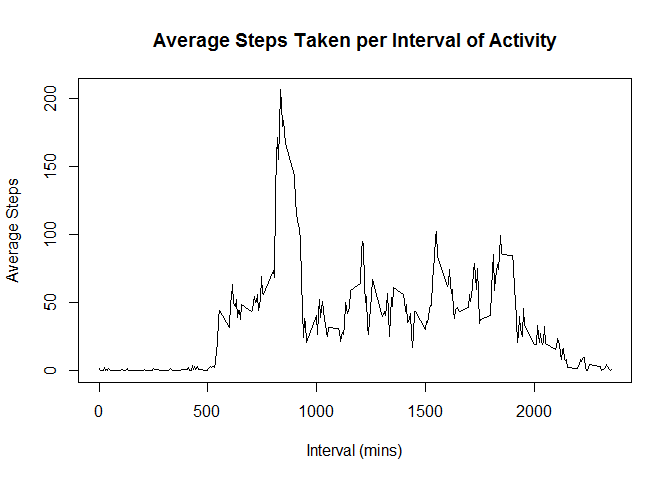
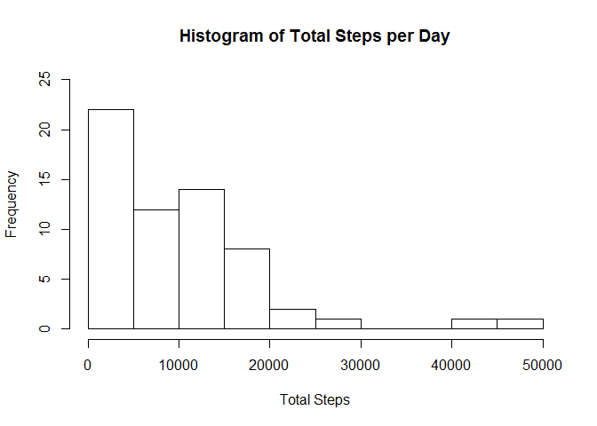
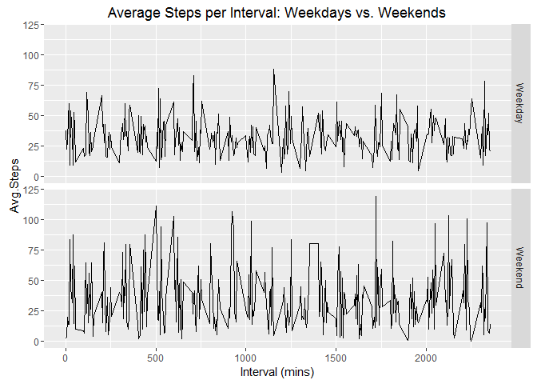

This analysis concerns personal activity data obtained from a wearable activity 
monitoring device over the months of October and November, 2012. The data consists
of the total number of steps taken in 5-minute intervals over the course of each 
day during these two months. The analysis proceeds in the order of the questions
presented below, after the data in question is read into R. 

First, the appropriate R packages for the analysis are loaded

```r
library(plyr); library(ggplot2)
```

```
## Warning: package 'plyr' was built under R version 3.2.4
```
Next, the activity data is downloaded and unzipped

```r
temp<-tempfile()
download.file("https://d396qusza40orc.cloudfront.net/repdata%2Fdata%2Factivity.zip",
              temp)
unzip(temp,exdir=".")
unlink(temp)
```
The code below is for reading the file into R from the user's working directory

```r
act<-read.csv("activity.csv",stringsAsFactors=FALSE)
```
Part 1: What is the mean total number of steps taken per day?  
1. Calculate the total number of steps taken per day

```r
stepsday<-ddply(act,"date",summarize,Total.Steps=sum(steps))
```
2. Make a histogram of the total number of steps taken each day

```r
hist(stepsday$Total.Steps,main="Histogram of Total Steps per Day",
     xlab="Total Steps",ylim=c(0,30))
```


  
3. Calculate and report the mean and median of the total number of steps taken per day

```r
mean(stepsday$Total.Steps,na.rm=TRUE)
```

```
## [1] 10766.19
```

```r
median(stepsday$Total.Steps,na.rm=TRUE)
```

```
## [1] 10765
```
Part 2: What is the average daily activity pattern?  
1. Make a time series plot of the 5-minute interval (x-axis) and the average number of steps taken, averaged across all days (y-axis)

```r
## Transform data
stepsint<-ddply(act,"interval",summarize,Avg.Steps=mean(steps, na.rm=TRUE))
## Plot data
plot(stepsint$interval,stepsint$Avg.Steps,type="l",
     main="Average Steps Taken per Interval of Activity",xlab="Interval (mins)",
     ylab="Average Steps")
```


  
2. Which 5-minute interval, on average across all the days in the dataset, contains the maximum number of steps?

```r
stepsint$interval[which(stepsint$Avg.Steps==max(stepsint$Avg.Steps))]
```

```
## [1] 835
```
Part 3: Imputing Missing Values  
1. Calculate and report the total number of missing values in the dataset (i.e. the total number of rows with NAs)

```r
nrow(act)-sum(complete.cases(act))
```

```
## [1] 2304
```
2. Devise a strategy for filling in all of the missing values in the dataset. The strategy does not need to be sophisticated. For example, you could use the mean/median for that day, or the mean for that 5-minute interval, etc
```
Use the average steps taken per interval to fill in NA values for a given interval
```
3. Create a new dataset that is equal to the original dataset but with the missing data filled in.

```r
actfill<-merge(act,stepsint,by="interval")
fillNAs<-sapply(actfill$steps, function(x) ifelse(is.na(x)==TRUE,actfill$Avg.Steps,x))
fullact<-cbind(fillNAs,act)[,c(1,3:4)]
names(fullact)[1]="steps"
```
4. Make a histogram of the total number of steps taken each day and Calculate and report the mean and median total number of steps taken per day. Do these values differ from the estimates from the first part of the assignment? What is the impact of imputing missing data on the estimates of the total daily number of steps?

```r
## Histogram of total steps per day in full dataset
fullstepsday<-ddply(fullact,"date",summarize,Total.Steps=sum(steps))
hist(fullstepsday$Total.Steps,main="Histogram of Total Steps per Day",
     xlab="Total Steps",ylim=c(0,25))
```



```r
## Mean and median steps per day in full dataset
mean(fullstepsday$Total.Steps)
```

```
## [1] 9419.081
```

```r
median(fullstepsday$Total.Steps)
```

```
## [1] 9124.245
```
  
```
Mean and median have both decreased by over 1000 steps per day. Accordingly,
distribution of daily number of steps has shifted towards zero. There are now
more instances of fewer steps in a given day compared to the original data.
```
Part 4: Are there differences in activity patterns between weekdays and weekends?  
1. Create a new factor variable in the dataset with two levels - "weekday" and "weekend" indicating whether a given date is a weekday or weekend day.

```r
fullact<-transform(fullact,date=strptime(date,"%Y-%m-%d"))
daytype<-vector()
for (i in 1:nrow(fullact)){
        daytype[i]<-weekdays(fullact$date[i])
}
fullact<-cbind(fullact,daytype)
fullact<-transform(fullact,daytype=as.factor(daytype))
```
2. Make a panel plot containing a time series plot of the 5-minute interval (x-axis) and the average number of steps taken, averaged across all weekday days or weekend days (y-axis). 

```r
fullact<-transform(fullact,daytype=sapply(fullact$daytype,function(x)
        ifelse(x=="Saturday"|x=="Sunday","Weekend","Weekday")))
fullstepsint<-ddply(fullact,c("interval","daytype"),summarize,Avg.Steps=mean(steps))
qplot(interval,Avg.Steps,data=fullstepsint,facets=daytype~.,geom="line",
      main="Average Steps per Interval: Weekdays vs. Weekends",
      xlab="Interval (mins)")
```


  
End of analysis


